# Bolbolestan Course Enrollment System

## Project Description

This is an enrollment course system for universities which was developed as the Internet Engineering course project that was offered at the University of Tehran.
In this project we aimed to implement a system like Golestan system (which is responsible for assigning courses to students) and has several features listed below:

- Student could signup and signin (secured with JWT filter implementation)

- Users could set a new password if they forget it

- In the Home page, Some information about the student is shown(such as personal information, cumulative GPA, total passed units and also the transcript of each semester)

- In Courses page, Students could see all the courses offered by university specified with their types and could easily add them to their new semester courses

- In Courses page, Students could also submit selected courses or delete them as they wish

- In Courses page, The student could also search for a specific course

- There is a weekly schedule page that the student can see submited courses as well

## This project is implemented in 9 phases as below:

1. CA1: Pure java, Maven, JSON Domain, Unit Test(JUnit), Git
2. CA2: Simple Web Server, Javalin
3. CA3: Tomcat, MVC, Java Servlet, JSP
4. CA4: HTML, CSS, Bootstrap
5. CA5: Spring, React, CORS, Standard API, RIA
6. CA6: MySQL Database, JDBC
7. CA7: Authentication, Authorization(JWT), SQL Injection
8. CA8: Docker, Nginx
9. CA9: Kubernetes, CI/CD

## Screenshots

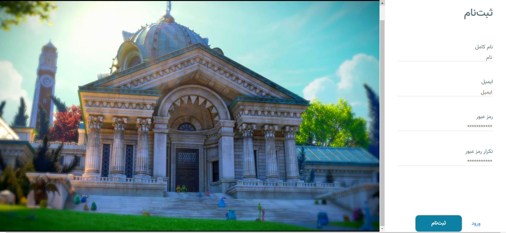
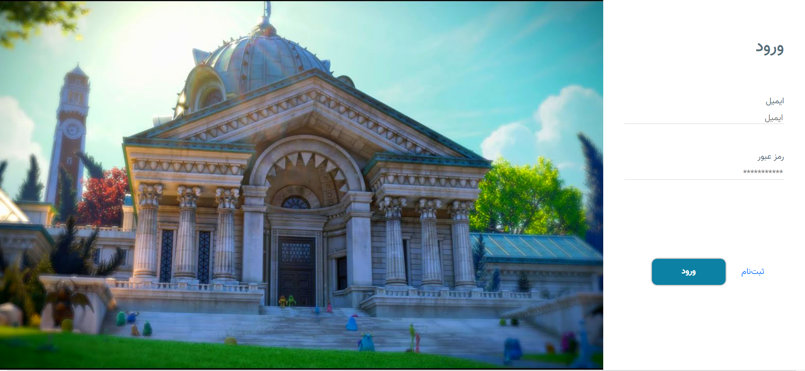
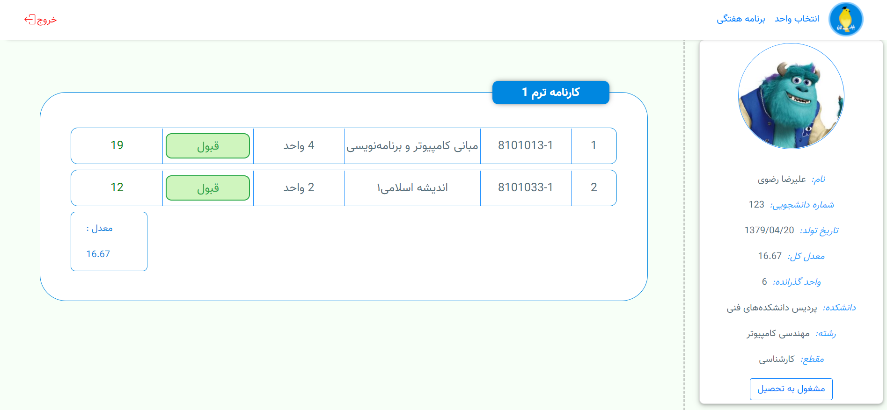
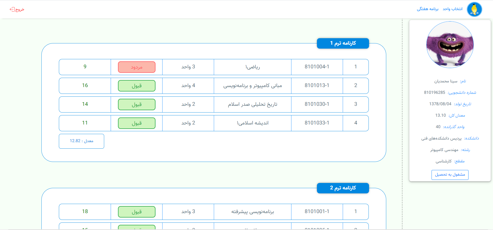
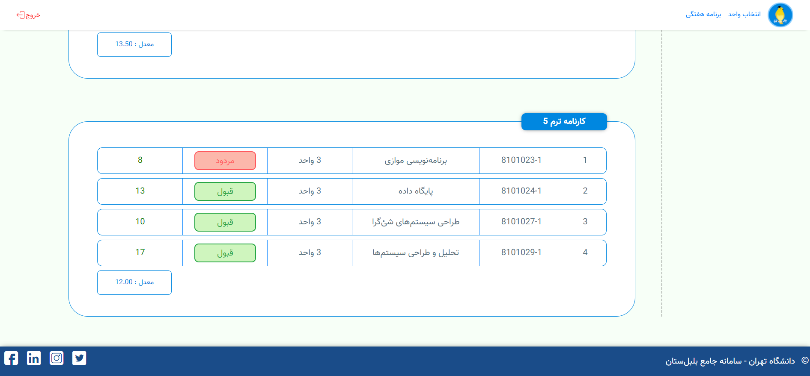
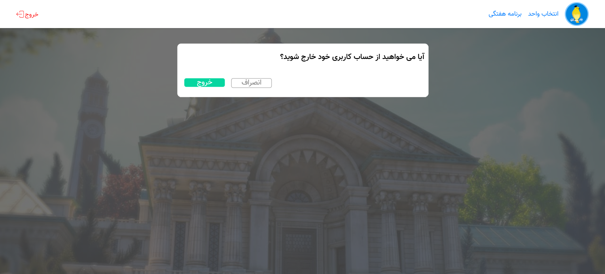
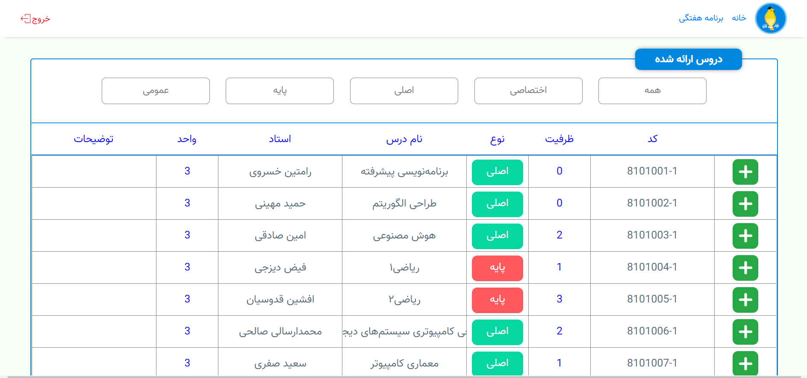
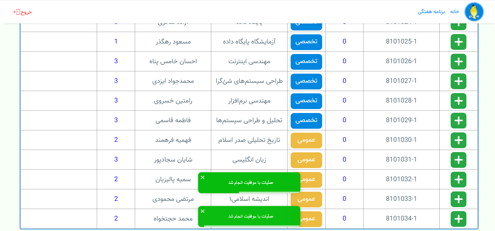
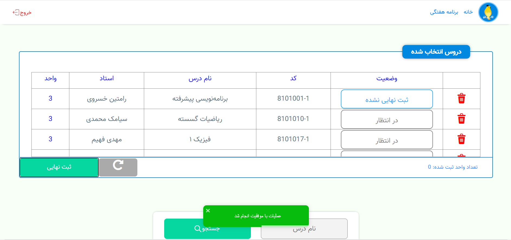
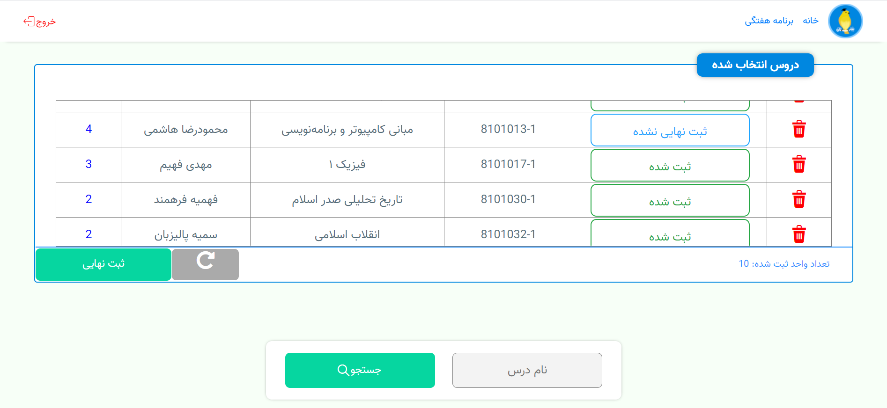
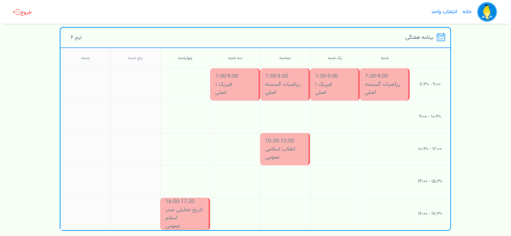
